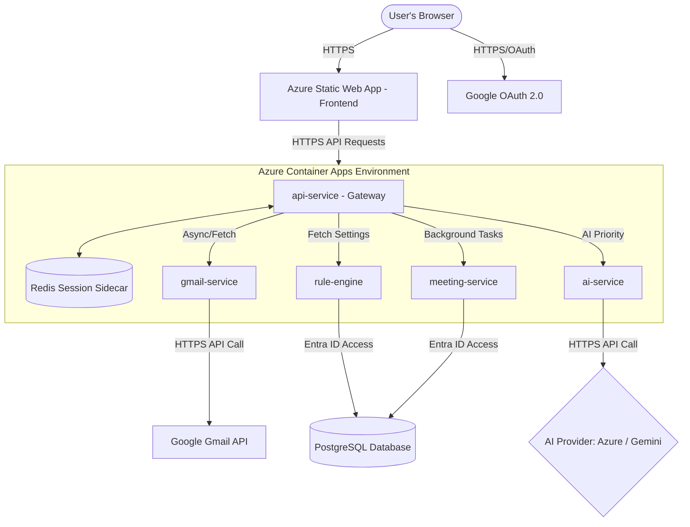
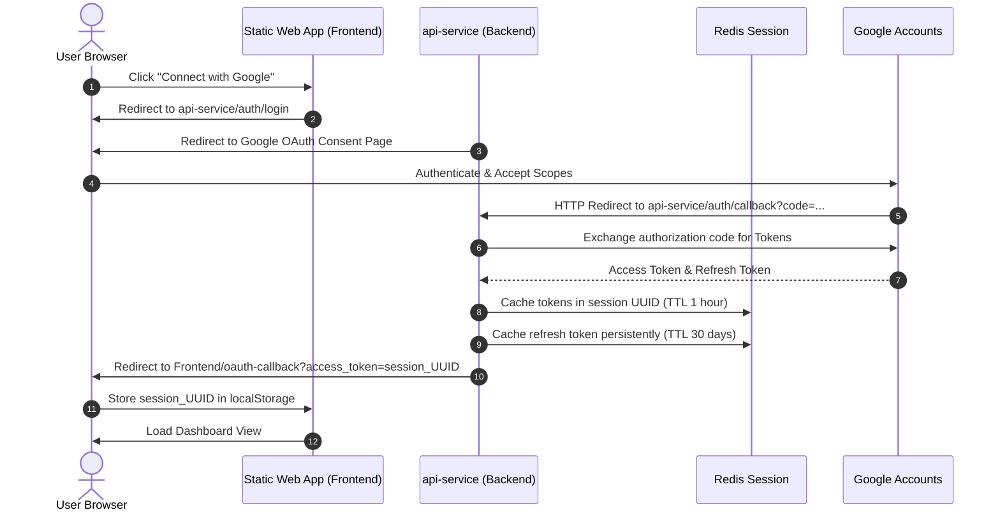
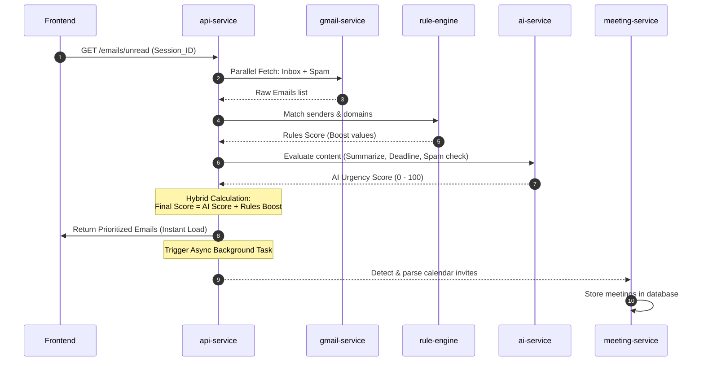

# AeroInbox: Application & Cloud Architecture Overview

This document provides a detailed overview of the application and cloud architecture of **AeroInbox (AI-Powered Executive Email Assistant)**. It describes how the frontend, microservices, databases, and Azure cloud resources integrate to provide secure, real-time email intelligence.

---

## 1. System Overview

AeroInbox is structured as a **Microservices-based Cloud Native Application**. The application is designed to ingest executive emails, prioritize them using a hybrid intelligence engine (Rules + AI), extract meeting/calendar actions, and present a unified, responsive dashboard to the user.



---

## 2. Application Architecture (Microservices Breakdown)

The backend is composed of **five independent microservices** developed in Python (FastAPI), plus a local Redis session database:

### A. Frontend Client (`frontend/`)
* **Tech Stack**: React, Tailwind CSS, Vite (TypeScript-enabled configuration).
* **Role**: Responsive dashboard providing single-page application views:
  * **Emails View**: Displays unread emails filtered by priority (*Critical, High, Medium, Low*).
  * **Meetings Calendar**: Groups scheduled meetings into *Today, Tomorrow, Upcoming, and Past* cards.
  * **Rules Center**: Allows the user to configure sender-based preference boosts, VIP domains, and keyword alerts.
  * **Notifications Center**: Triggers real-time alerts for priority updates, false-positive spam warnings, and meeting updates.

### B. API Service Gateway (`services/api-service/`)
* **Role**: Central gateway and orchestrator.
* **Key Operations**:
  * **Session Management**: Replaces browser-stored tokens with secure `session_id` tokens mapped to credential storage in Redis.
  * **Authentication Interceptor**: Automatically refreshes Google access tokens when encountering `401 Unauthorized` states, updating active Redis sessions transparently.
  * **Parallel Orchestration**: Triggers concurrent fetches to the Gmail service, evaluates Rule scores and AI scores, and aggregates results.
  * **Background Offloading**: Launches heavy calculations (e.g. meeting detection parsing) using FastAPI's async background worker pool to return email lists to the user instantly.

### C. Gmail Service (`services/gmail-service/`)
* **Role**: Interface to the Google Mail API.
* **Key Operations**:
  * **Spam Scan**: Scans both the standard `INBOX` and `SPAM` folder to locate priority false-positives (messages flagged as spam by Google but verified as crucial by AI).
  * **Label Management Center**: Modifies email folder categories (archiving, trash, folders).

### D. AI Service (`services/ai-service/`)
* **Role**: Semantic and cognitive reasoning hub.
* **Key Operations**:
  * **Multi-Provider LLM Router**: Automatically redirects prompts to **Azure OpenAI**, **Azure AI Foundry**, standard **OpenAI**, or **Google Gemini** depending on available API keys.
  * **Cognitive Classifier**: Analyzes emails for urgency level, spam false-positive validation, calendar requests, and deadlines.
  * **JSON Extractor**: Normalizes unstructured LLM responses into strict application JSON schemas.

### E. Rule Engine (`services/rule-engine/`)
* **Role**: Static deterministic scorer.
* **Key Operations**:
  * **Rules Database**: Saves VIP senders, keywords, client domains, and override boosts in a PostgreSQL table (`user_rules`).
  * **Seeding**: Automatically bootstraps default enterprise rules for new users.

### F. Meeting Service (`services/meeting-service/`)
* **Role**: Calendar extraction and scheduling.
* **Key Operations**:
  * **Parsers**: Decodes Google Meet, Zoom, MS Teams links, and `.ics`/VCALENDAR invitation packages.
  * **Data Integrity**: Cleans and normalizes participant lists, checks duplicates, manages cancellations, and processes reschedules in the PostgreSQL `meetings` table.

---

## 3. Data & Communication Flows

### A. End-to-End User Authentication Flow
This diagram details how the secure session and Google OAuth consent flow operates:



### B. Email Prioritization & Scoring Engine Flow
When the dashboard loads, the API Gateway coordinates parallel processing to fetch and calculate priority:



---

## 4. Cloud Infrastructure Architecture

AeroInbox is provisioned in **Azure** using a highly secure, private network structure built with **Terraform**.

```
+--------------------------------------------------------------------------------------------------+
|                                  Azure Virtual Network (VNet)                                    |
|                                                                                                  |
|  +------------------------+      +------------------------------------------------------------+  |
|  |     appgw-subnet       |      |                   containerapps-subnet                     |  |
|  |                        |      |                                                            |  |
|  |  [Application Gateway  |      |   +----------------------------------------------------+   |  |
|  |    (WAF v2, HTTPS)]    |      |   |        Container Apps Environment (Public)         |   |  |
|  +-----------+------------+      |   |                                                    |   |  |
|              | (HTTPS)           |   |  +-------------+    +---------------+              |   |  |
|              v                   |   |  | api-service |<-->| Redis Sidecar |              |   |  |
|  +-----------+------------+      |   |  +------+------+    +---------------+              |   |  |
|  |  Private DNS Resolution|      |   |         | (Private DNS VNet Routing)               |   |  |
|  |   (proudsea-97b69863)  |      |   |         +----+--------------------------------+    |   |  |
|  +-----------+------------+      |   |              |                                |    |   |  |
|              |                   |   |              v                                v    |   |  |
|              +-------------------+-->|       [Other microservices]           [Internal ports] |   |  |
|                                  |   +----------------------------------------------------+   |  |
|                                  +------------------------------------------------------------+  |
|                                                                                                  |
|  +-------------------------------------+      +------------------------------------------------+ |
|  |          integration-subnet         |      |             privateendpoints-subnet            | |
|  |                                     |      |                                                | |
|  |   [Azure Database for PostgreSQL    |      |    [Key Vault Private Endpoint]                | |
|  |        (Flexible Server)]           |      |    [ACR Private Endpoint]                      | |
|  +-------------------------------------+      +------------------------------------------------+ |
+--------------------------------------------------------------------------------------------------+
```

### Infrastructure Core Components:
1. **Application Gateway / WAF v2**:
   * Sits in `appgw-subnet`. Exposes a public IP acting as the API Gateway's secondary ingress point.
   * Includes Web Application Firewall (WAF) policies enforcing OWASP protection rules.
   * Connects securely to the container apps environment.
2. **Container Apps Environment**:
   * Sits in `containerapps-subnet`. Runs the microservice Docker containers.
   * **`api-service` Sidecar**: Runs both the FastAPI gateway and a local Redis database inside the same pod. The gateway queries Redis locally over `127.0.0.1:6379`, avoiding VNet routing overheads or authentication blocks.
   * **Service Discovery**: Microservices communicate privately using the VNet's private DNS zone (`http://ai-service`, `http://gmail-service`, etc.).
3. **Database Layer (PostgreSQL)**:
   * Sits in `integration-subnet`. Integrated directly with the VNet.
   * Secured using **Entra ID authentication** via Managed Identity. The microservices fetch short-lived tokens from Azure at runtime rather than storing database passwords.
4. **Secrets & ACR (Private Endpoints)**:
   * Key Vault, Container Registry, and Storage Accounts are kept completely isolated from the internet. They can only be accessed through **Private Endpoints** mapping to internal private IPs in `privateendpoints-subnet`.

---

## 5. Security & Access Control Design

* **Managed Identities**: All Container Apps run under a User-Assigned Managed Identity (`id-aeroinbox-dev`). This identity has direct access roles to:
  * **Azure Key Vault**: Secret Reader access to read credentials dynamically.
  * **Azure Container Registry**: AcrPull access to pull images.
  * **PostgreSQL**: Authenticates as a database administrator dynamically.
* **Secret Cache System (`azure_secrets.py`)**:
  * Microservices retrieve configurations via environmental fallbacks first (highly useful during local Docker Compose runs).
  * In production, the system calls Azure Key Vault. It caches results locally using `@lru_cache` to minimize API latency and request costs.
* **Content Security Policy (CSP)**:
  * Enforced on Azure Static Web Apps via [staticwebapp.config.json](file:///c:/Users/ASUS/OneDrive/Desktop/Ai_Assistan_Email/frontend/staticwebapp.config.json).
  * Strict directives authorize API endpoints (`connect-src`), style origins (`style-src`), image domains (`img-src`), and scripts (`script-src`), preventing injection vulnerabilities.
